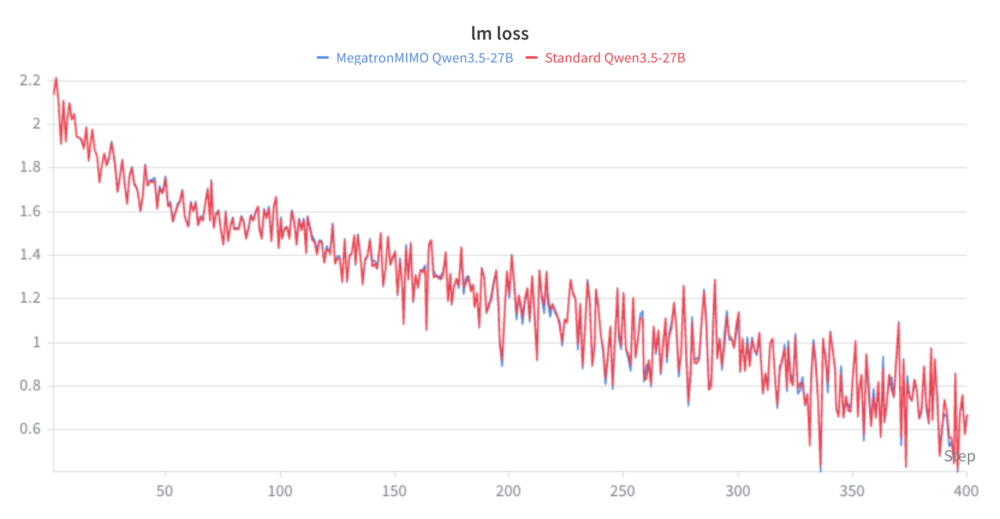

# Heterogeneous Parallelism for Qwen3.5-VL with MegatronMIMO

## Overview

[Qwen3.5-VL](https://huggingface.co/Qwen/Qwen3.5-27B) is a dense vision-language model: it
takes interleaved **images and text** and produces text. Like every VLM, it is
really two very different models stitched together: a large autoregressive
**language model** and a comparatively tiny **vision encoder** that turns pixels
into tokens the language model can read.

This tutorial walks through a concrete, tested use case: **full-parameter
supervised fine-tuning (SFT) of the 27B dense Qwen3.5-VL on real multimodal
conversation data** — receipts, captions, medical images with question/answer
text — using *MegatronMIMO* with *heterogeneous parallelism*.

### Why heterogeneous parallelism

Standard Megatron-Bridge trains Qwen3.5-VL as one integrated model on a single
shared GPU layout. That means the small vision encoder is pinned to the **same
ranks** as the language model and competes for its critical path, even though it
needs a fraction of the compute. The encoder is the hidden drag on an otherwise
efficient language-model pipeline.

**MegatronMIMO** treats the model as a *graph of modules* — here `language` and
`images` — connected by activation edges, and lets each module declare its own
parallel layout and run on its **own GPU set**. Modules on disjoint ranks
exchange forward activations and backward gradients through **boundary
communicators**. Because the vision encoder fits on a single rank, moving it
*off* the language ranks lets its work overlap the language model's critical
path instead of blocking it.

In the benchmarked 27B MIMO setup, that change yields up to **+44.7% active
tokens/s/GPU** and **24–35% lower wall-clock step time** versus the strongest
standard Megatron-Bridge baseline (§4), with **matching loss curves** in the
reference run report (§5).

### Key concepts

Three terms recur throughout. Keep them straight and the rest follows:

- **Model abstraction.** *non-MIMO* is the standard integrated Megatron model
  (vision encoder, projector, and language model as internal submodules).
  *MIMO* is the module-graph abstraction above — a graph of computational
  modules connected by activation edges, with support for multiple encoders per
  modality.
- **Placement.** *colocated* means module rank sets overlap; *non-colocated*
  means module rank sets are disjoint.
- **Layout.** *homogeneous* means one declared parallel topology (or equivalent
  declared component topologies); *heterogeneous* means at least two declared
  component topologies differ.

In those terms, the **standard baseline** is *non-MIMO + colocated +
homogeneous*, and the path covered here is *MIMO + non-colocated +
heterogeneous*: `language` and `images` run on disjoint rank sets and declare
different TP/PP/DP layouts.

### What you will do

1. Convert a Hugging Face Qwen3.5-VL checkpoint into the MegatronMIMO format.
2. Launch the 27B non-colocated SFT job on a multi-node cluster.
3. Review benchmark results and a Weights & Biases (W&B) reference report
   showing loss parity and step-time behavior against the standard
   Megatron-Bridge baseline.

**Scope.** This tutorial is hands-on for the MegatronMIMO path. It covers
**dense** Qwen3.5-VL, two components (`language` + `images`), and
**non-colocated** full-parameter SFT on Hugging Face conversation data, using
the reference 27B layout. In this tutorial, the **reference 27B layout** means
the tested, known-good recipe for this workflow: it fits in memory and converges.
Performance is a first-class part of the tutorial: the results section reports
a controlled comparison against the standard
Megatron-Bridge Qwen3.5-VL path on the Hugging Face VLM datasets currently
supported for this path:
[CORD-v2](https://huggingface.co/datasets/naver-clova-ix/cord-v2),
[RDR](https://huggingface.co/datasets/quintend/rdr-items), and
[MedPix-VQA](https://huggingface.co/datasets/mmoukouba/MedPix-VQA).

**Assumed knowledge.** Familiarity with standard Qwen3.5-VL SFT in
Megatron-Bridge and with Megatron parallelism (tensor/pipeline/data parallel —
TP/PP/DP) is assumed; the hands-on steps below focus on what changes for
MegatronMIMO. For the system design, colocated execution, and the full results,
see the paper:
[Heterogeneous Parallelism for Multimodal Large Language Model Training](https://arxiv.org/abs/2605.27678).


## 1. Setup

You need a Megatron-Bridge environment (the
[NeMo Framework container](https://catalog.ngc.nvidia.com/orgs/nvidia/containers/nemo/tags)
already provides one), Hugging Face access to the `Qwen/Qwen3.5-27B` model, and
a shared filesystem visible on every node and inside the container.

Set a workspace and an experiment root:

```bash
export WORKSPACE=/path/to/shared/workspace
export EXPERIMENT_ROOT=${WORKSPACE}/qwen35_vl_mimo
```

The examples use this directory layout:

```
${EXPERIMENT_ROOT}/
  models/mimo/         # converted MegatronMIMO checkpoints
  results/mimo/        # Slurm run outputs
```

The reference 27B training job uses 3 8-GPU nodes with the default launcher settings.


## 2. Convert a Hugging Face checkpoint

Conversion imports the HF weights into the MegatronMIMO format and, as a
round-trip check, exports them back to HF. For the reference 27B training job,
declare the per-component conversion layout explicitly:

```bash
MIMO_MODEL_ROOT=${EXPERIMENT_ROOT}/models/mimo
WORKSPACE=${MIMO_MODEL_ROOT} \
MODEL_NAME=Qwen3.5-27B \
LANGUAGE_TP=4 \
LANGUAGE_DP=1 \
LANGUAGE_RANK_OFFSET=0 \
VISION_TP=1 \
VISION_DP=1 \
VISION_RANK_OFFSET=4 \
  bash examples/megatron_mimo/qwen35_vl/conversion.sh
```

The component names are fixed for Qwen3.5-VL:

- `language` routes the language-model weights.
- `images` routes the vision-encoder weights.

This writes the MegatronMIMO checkpoint to
`${MIMO_MODEL_ROOT}/Qwen3.5-27B-mimo`, which is the default
`PRETRAINED_CHECKPOINT` for the Slurm launcher.

The conversion layout above uses 5 ranks, while the training layout below uses
17 ranks. That is expected: the MegatronMIMO checkpoint can be loaded into a
different TP/PP/DP layout for training. In practice, use the smaller conversion
layout to create the checkpoint, then let the Slurm training job declare the
reference 17-rank layout.


## 3. Launch 27B non-colocated SFT

This run is **MIMO + non-colocated + heterogeneous** (see [Key
concepts](#key-concepts)): `language` and `images` run on disjoint rank sets and
declare different TP/PP/DP layouts. The standard baseline it is compared against
is **non-MIMO + colocated + homogeneous**.

The reference 27B layout is:

```
ranks 0-15   language   TP=4  PP=2  DP=2     (rank_offset=0)
rank  16     images     TP=1  PP=1  DP=1     (rank_offset=16)
world_size = 17
```

This layout comes from a baseline sweep of standard Megatron-Bridge runs for
the 27B setup: smaller 8-GPU candidates did not fit, while wider TP or deeper
PP alternatives completed but delivered lower active tokens/s/GPU. For the MIMO
comparison, we keep that selected LLM layout unchanged and change only the
image-encoder placement. The image encoder fits on one rank, so non-colocated
MIMO keeps it off the language ranks and lets its work overlap the language
model's critical path.

The reference 27B job is launched with
`examples/megatron_mimo/qwen35_vl/slurm_sft.sh`. The script declares the
17-rank MIMO layout, validates the allocation, and launches the language and
image ranks with an MPMD `srun`.

All knobs live in a single `USER CONFIGURATION` block at the top of the script,
and each one is environment-overridable at submit time. The MIMO layout is set
by these defaults (already the reference 17-rank layout):

```bash
MIMO_LANGUAGE_TP=4   MIMO_LANGUAGE_PP=2   MIMO_LANGUAGE_DP=2   MIMO_LANGUAGE_OFFSET=0
MIMO_IMAGES_TP=1     MIMO_IMAGES_PP=1     MIMO_IMAGES_DP=1     MIMO_IMAGES_OFFSET=16
```

After pointing `WORKSPACE` at the shared filesystem that holds your converted
checkpoint, submit with the defaults:

```bash
WORKSPACE=/path/to/shared/workspace \
  sbatch examples/megatron_mimo/qwen35_vl/slurm_sft.sh
```

Override hyperparameters inline without editing the file:

```bash
sbatch --export=ALL,SEQ_LENGTH=2048,TRAIN_ITERS=100 \
  examples/megatron_mimo/qwen35_vl/slurm_sft.sh
```

Before submitting, check these run settings:

- `PRETRAINED_CHECKPOINT` defaults to
  `${EXPERIMENT_ROOT}/models/mimo/Qwen3.5-27B-mimo`, matching the 27B conversion
  command in Section 2.
- Run outputs land under `${EXPERIMENT_ROOT}/results/mimo/${RUN_NAME}`.
- `MICRO_BATCH_SIZE` is the global microbatch across the language DP group. With
  language DP=2, `MICRO_BATCH_SIZE=2` gives a language-local microbatch of 1,
  matching standard 27B SFT.

<details>
<summary>Cluster allocation note</summary>

The `#SBATCH` defaults request 3 nodes of 8 GPUs and pack the 17 active ranks as
8 + 8 + 1 tasks per node. This suits clusters that allocate whole 8-GPU nodes
exclusively. The only hard requirement is that the allocation provides at least
17 GPUs; adjust the node count, GPUs-per-node, partition, account, and container
settings for your own cluster.

</details>


### Monitoring the run

At startup the job prints a banner with the resolved layout: language and image
TP/PP/DP, active ranks, allocated GPUs, batch sizes, dataset, and checkpoint
settings. Check that it matches the 17-rank layout above; if it does not,
cancel the job and fix the launcher settings before rerunning.

A healthy startup for the reference 27B MIMO layout looks like this
(job-specific values shown as placeholders). The dataset, sequence length, and
training-iteration values below are the launcher defaults; override them as
needed for your run.

```text
======================================
Qwen3.5-VL 27B MegatronMIMO SFT (non-colocated)
======================================
Job ID:          <job_id>
Nodes:           3
GPUs/node:       8
Active ranks:    17
Allocated GPUs:  24
Language:        TP=4 PP=2 CP=1 DP=2 offset=0
Images:          TP=1 PP=1 CP=1 DP=1 offset=16
Batch:           MBS=2, GBS=32, language-local MBS=1, num_microbatches=16
Dataset:         cord_v2
Sequence length: 4096
Train iters:     500
Checkpoint:      ${EXPERIMENT_ROOT}/models/mimo/Qwen3.5-27B-mimo
======================================
Packed MPMD srun layout:
  <node-0>: 8 task(s)
  <node-1>: 8 task(s)
  <node-2>: 1 task(s)
```

During training, each iteration logs its `lm loss` and step time to the Slurm
output file (`qwen35vl_mimo_sft_<jobid>.out` in the directory you submitted
from, at `LOG_INTERVAL=1`). Set `WANDB_API_KEY` to also stream loss and
step-time curves to Weights & Biases. For expected training behavior, compare
your run with the W&B reference report in
[Loss parity and run report](#5-loss-parity-and-run-report); that section also
embeds the loss-parity plot for offline review. Run
artifacts land under `${EXPERIMENT_ROOT}/results/mimo/${RUN_NAME}`.

MIMO tokens/s/GPU is not logged today (heterogeneous FLOPs accounting is not yet
wired in — see [Limitations](#6-limitations)), so use the
per-iteration step time as the throughput signal.


## 4. Benchmark results — performance

The numbers below are benchmark results from a controlled comparison between the
standard baseline and MIMO on Qwen3.5-VL 27B (bf16). You do not need to run the
standard baseline to use the MIMO workflow above.

**Comparison setup.** The standard Megatron-Bridge baseline is TP=4 PP=2 DP=2
(16 GPUs), the strongest standard layout found by a parallelism sweep — i.e.
*non-MIMO + colocated + homogeneous*. MIMO uses the same language layout plus a
single image rank (language TP=4 PP=2 DP=2 + image TP=1 PP=1 DP=1, 17 active
ranks), i.e. *MIMO + non-colocated + heterogeneous*. Both paths use Qwen3.5-VL
27B, bf16, the same supported HF VLM dataset path, and matched language-local
microbatch size. The performance sweep ran 20 iterations; timing is the mean
step time over iterations 3–20.

**Metric.** We report **active tokens/s/GPU** — throughput divided by the number
of ranks actually doing work (16 for the baseline, 17 for MIMO) — and the
wall-clock step-time reduction.

The results use the Hugging Face VLM dataset makers currently supported by
Megatron Bridge for this path. All three are real datasets with one image per
sample: CORD-v2 is receipt parsing with variable image resolutions, RDR is
image captioning with a fixed 768×768 image shape, and MedPix-VQA is medical VQA
with variable image resolutions and short question/answer text.

MIMO-win deltas (higher is better) across the three datasets:

| seq / GBS | CORD-v2 wall Δ | CORD-v2 t/s/GPU Δ | RDR wall Δ | RDR t/s/GPU Δ | MedPix wall Δ | MedPix t/s/GPU Δ |
|---|---:|---:|---:|---:|---:|---:|
| 2048 / 32 | 28.1% | +31.0% | 27.6% | +29.9% | 23.8% | +23.6% |
| 2048 / 64 | 30.5% | +35.5% | 35.0% | +44.7% | 32.7% | +39.8% |
| 4096 / 32 | 23.5% | +23.0% | 23.7% | +23.3% | 23.7% | +23.3% |
| 4096 / 64 | 27.7% | +30.2% | 27.9% | +30.6% | 26.2% | +27.5% |

These deltas are measured for the reference MIMO 27B non-colocated setup. They are
not a general guarantee for arbitrary models, encoders, datasets, or layouts;
re-measure if you adapt the workflow to a different configuration.


## 5. Loss parity and run report

A faster path is only useful if it trains the same model. In the loss-parity
run, the standard baseline and MIMO start from the same converted
Qwen3.5-VL 27B checkpoint and produce matching loss trajectories.

**Setup.** MedPix-VQA, seq=2048, GBS=32, 400 training iterations, from the
pretrained checkpoint. The standard baseline uses MBS=1 and MIMO uses MBS=2, so
both paths see a language-local microbatch of 1. Both load model weights only;
optimizer and RNG state start fresh.

**Reference artifact.** The
[Weights & Biases report](https://api.wandb.ai/links/nvidia-nemo-fw-public/6bfq1baw)
is the primary interactive artifact for this run. It includes the standard-vs-MIMO
`lm loss` comparison and per-iteration step-time curves. The static plot below
is included so the loss-parity evidence remains visible in rendered docs and PR
review without opening W&B.

The embedded plot overlays the `lm loss` curves from the standard baseline and
MIMO runs. The curves track each other over the 400-iteration window, with no
systematic drift between the two paths.



In the plot legend, **Standard Qwen3.5-27B** is the standard Megatron-Bridge
baseline (non-MIMO + colocated + homogeneous), and **MegatronMIMO Qwen3.5-27B**
is the MIMO run (MIMO + non-colocated + heterogeneous).

This is the expected loss-parity result for the reference MIMO 27B setup: MIMO
uses a different rank layout, but it trains from the same checkpoint and follows
the same loss trajectory as the standard Megatron-Bridge path.


## 6. Limitations

The current Qwen3.5-VL MegatronMIMO example targets one workflow well — dense,
two-component, non-colocated full-parameter SFT. The following are not yet
supported or tested, so you can avoid paths that are not expected to work:

- **MoE variants** — only dense Qwen3.5-VL is wired up.
- **MTP** — the example disables Multi-Token Prediction layers.
- **Packed sequences** — MIMO packed-sequence behavior is untested.
- **Energon datasets** — use the HF conversation provider.
- **Colocated layouts** — only non-colocated (disjoint ranks) is covered here.

## 7. References

- Paper: [Heterogeneous Parallelism for Multimodal Large Language Model Training](https://arxiv.org/abs/2605.27678)
- MegatronMIMO examples: [`examples/megatron_mimo/`](../../examples/megatron_mimo/README.md)
- Qwen3.5-VL MIMO scripts: [`examples/megatron_mimo/qwen35_vl/`](../../examples/megatron_mimo/qwen35_vl/README.md)
- Standard (non-MIMO) Qwen3.5-VL examples: `examples/models/qwen/qwen35_vl/`
